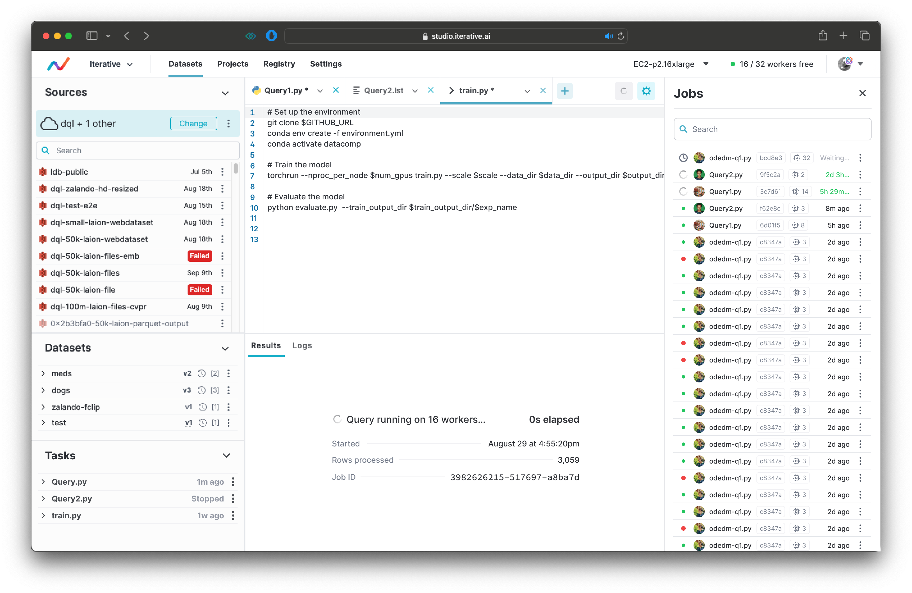
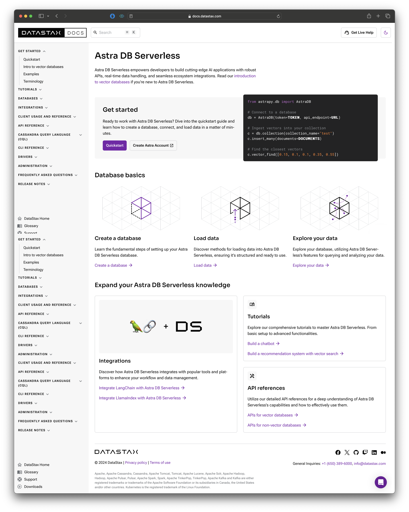
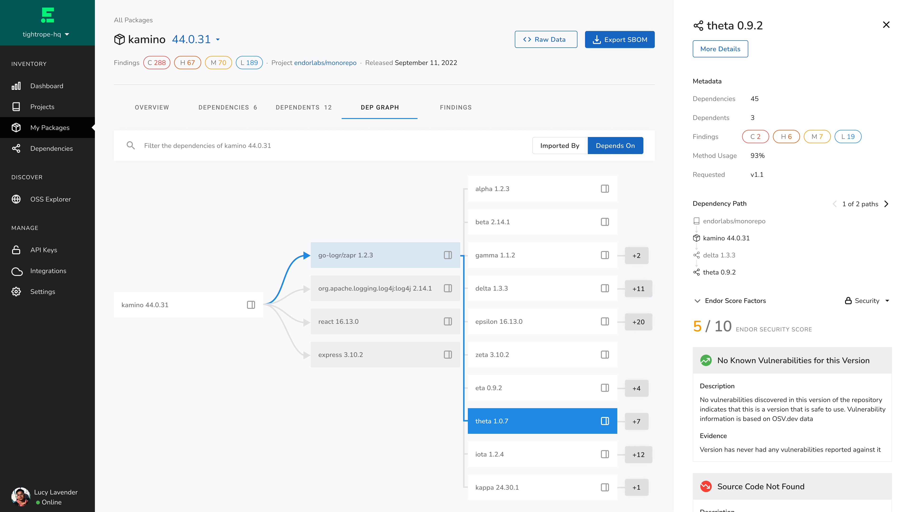
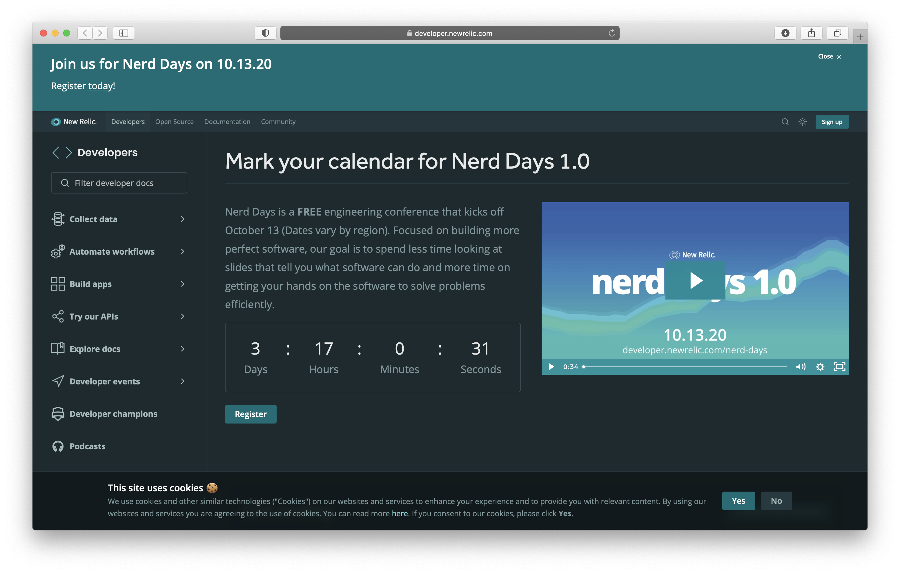
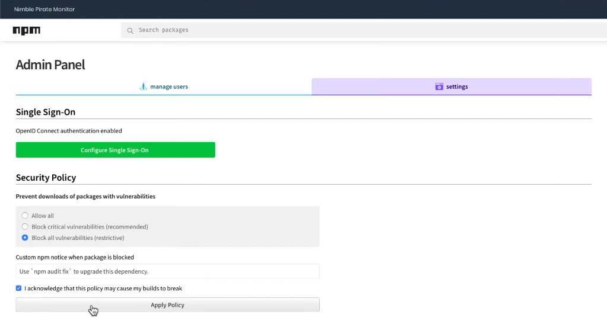
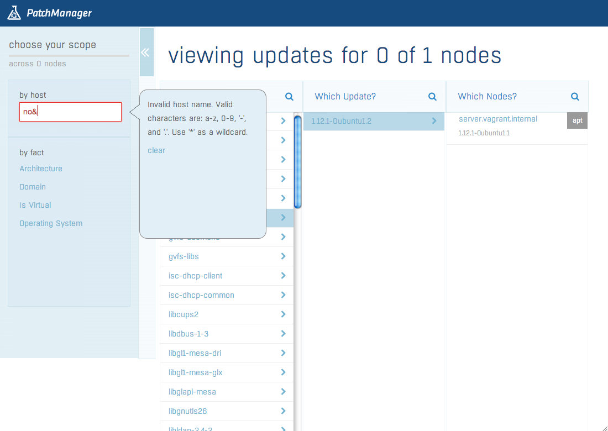
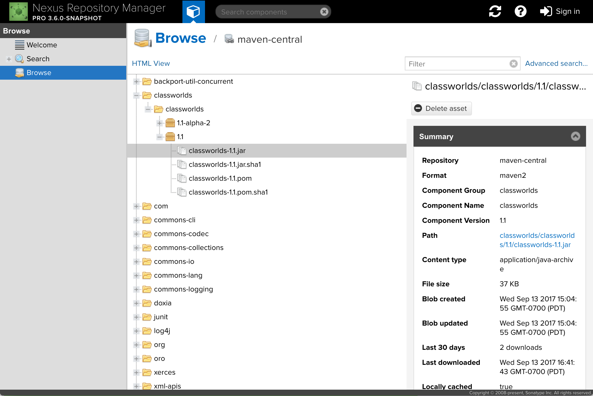
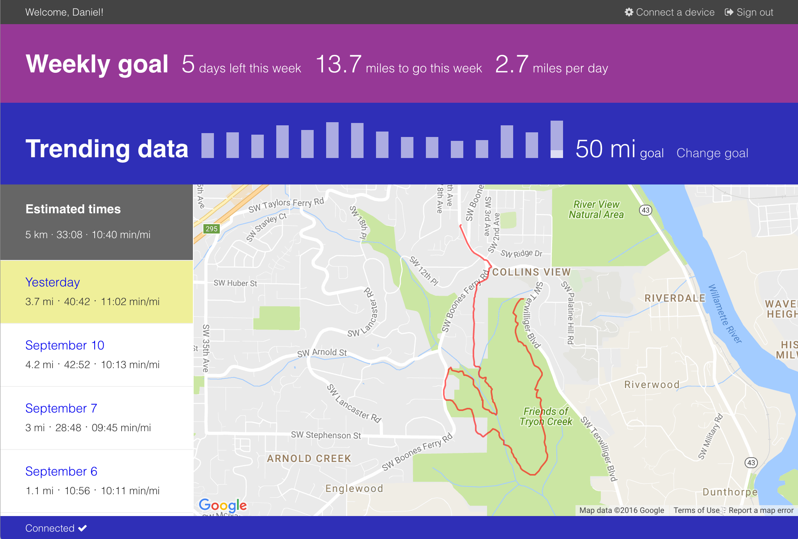

import Layout from "../components/layout"
import { Link } from "gatsby"
import ProjectHero from "../components/project_hero"
import "../styles/index.css"

export default Layout

<SEO title="Home" />

# Daniel Sauble

  

I&rsquo;m a Product Designer specializing in ML tools for software developers.

I currently work at <a href="https://prefect.io" target="_blank">Prefect</a> on workflow orchestration for data engineers and am also a teaching faculty for software engineering at the Harvard Extension School.
More details in my <Link to="/resume">resume</Link>.

Want to work with me? Send a note to <a href="mailto:djsauble@gmail.com">djsauble@gmail.com</a>.

## Portfolio

<ProjectHero
  to="/iterative"
  title="Iterative"
  description="Remote code execution for ML models"
>
  
</ProjectHero>

<ProjectHero
  to="/vector_db"
  title="DataStax"
  description="Docs site to learn how to use a vector database"
>
  
</ProjectHero>

<ProjectHero
  to="/endor_labs"
  title="Endor Labs"
  description="Secure your software supply chain"
>
  
</ProjectHero>

<ProjectHero
  to="/developer"
  title="New Relic"
  description="Docs site to learn how to build custom apps on the New Relic platform"
>
  
</ProjectHero>

<ProjectHero
  to="/package_filtering"
  title="npm"
  description="Keep bad npm packages out of your applications"
>
  
</ProjectHero>

<ProjectHero
  to="/ppm"
  title="Puppet"
  description="Easily patch your IT systems with an existing configuration
        management tool"
>
  
</ProjectHero>

<ProjectHero
  to="/browse"
  title="Sonatype"
  description="Peruse the contents of your software repositories in a structured way"
>
  
</ProjectHero>

<ProjectHero
  to="/runbudget"
  title="Personal project"
  description="Visualization tool to help long-distance runners build their mileage
        safely"
>
  
</ProjectHero>