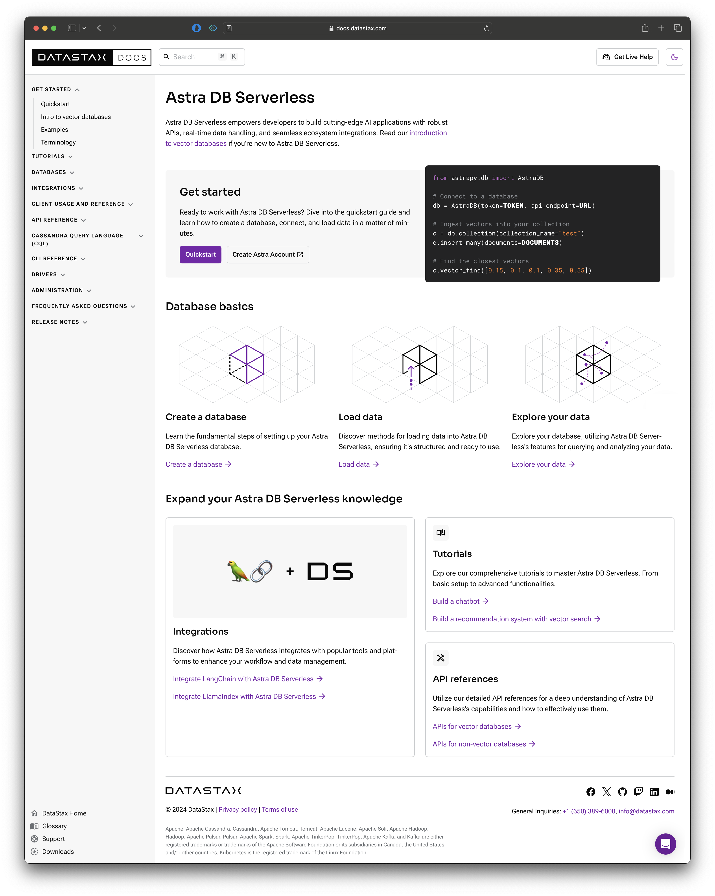

import ChildLayout from "../components/child_layout"

export default ChildLayout

<SEO title="DataStax Astra DB docs"/>

# DataStax Astra DB docs

Astra DB Serverless is a new vector database by DataStax.
I was brought in as a content designer and content writer to launch a new docs site.

## The legacy site

Our <a href="https://docs.datastax.com/en/astra-serverless/docs/">existing doc site</a> was a complicated mess, both from a content and an ops perspective:

When I joined the project, the first thing I did was to conduct a <a href="https://docs.google.com/document/d/1WzvFuYboq0mBvtNf7eQhr3Hva3DfqOZrppjdK5OHNt4/edit?usp=sharing">UX review of the current site</a>.
My top findings are below, but I had a large number of suggestions above and beyond these.

* The big "Get started" affordance takes you directly to the product, not a quickstart or tutorial docs.
In fact, a lot of the links take you out of the docs without warning.

* The writing tends to ramble instead of getting to the point.
In a well-designed product, you don't need to pass on as much background and context to the reader.

* The global nav doesn't have a coherent structure and doesn't use language that developers expect.
Since developers are our primary persona, and docs are the primary way developers evaluate a tool, this is a significant perception and usability problem.

Rather than iterating on the current site, we decided to create a docs site from scratch.
Once we launched, we planned to rewrite the existing content and migrate it to the new site.

## IA proposal

Once I finished the UX review, my next task was to come up with an IA proposal for the new site.
I started by writing down a few principles to try and avoid the issues with the existing site:

* Don’t grow a jungle. Limit the IA to two levels of hierarchy (excluding the landing page) so people always know where they are.

* Don’t make me think. Every page should adhere to a template with a well-defined purpose: landing, overview, tutorial, use case, reference, or integration.

* Docs don’t exist to serve docs. Pages that exist solely to link to other pages are an anti-pattern.

* No dead ends. Users should always know the next logical page(s) of content that builds on what they just learned.

* Be opinionated. No more than one primary CTA per page.

After iterating with the other stakeholders on the project, we ended up with the following IA for the new site:

* Get started

  * Quickstart
  * Concepts
  * Examples
  * Terminology

* Tutorials

  * Build a chatbot
  * Enhance a recommendation system
  * Create an AI agent

* Data

  * Create a database
  * Load your data
  * Explore your data
  * [FUTURE] Analyze your data

* Administration

  * API keys
  * Assigning permissions
  * Custom DNS
  * IP access list
  * Private endpoints
  * SSO

* Client References

  * JSON API
  * Node.js
  * Python

* Integrations

  * CassIO
  * HuggingFace
  * LangChain
  * LlamaIndex
  * OpenAI

## Tree testing

I wanted to validate this early structure as quickly as possible.
I recruited six ML engineers with userinterviews.com and conducted interviews with each one.
Participants were given an early prototype of the site and asked to complete a few navigational tasks.

* Task 1: Open the doc site and tell me what key concepts you're looking for immediately. What's missing?

* Task 2: Imagine you’re not familiar with vector databases. Where would you go to learn more about them?

* Task 3: Imagine you want to try out Astra Vector. Where would you go to do that?

* Task 4: Go to the quickstart page and imagine that you are completing the tutorial. How would you go about it? Does anything seem off?

* Task 5: Imagine that you’re going to use and deploy Astra Vector at work, can you walk me through the docs you would need and in what order?

* Task 6: How would you learn to use OpenAI with Astra Vector?

We learned that our early iterations of the landing page and quickstart were quite solid, they were able to locate this content easily using the prototype IA.
We didn't get strong signal about the administration content, because the people we talked to weren't responsible for operations in their company, so we left this as an open question.

## MVP delivery

Around this time, I learned that the lead writer on the project would be unable to help deliver the content for the MVP site.
As a result, I took on the lead writing role and delivered over half of the content that we shipped in the initial MVP, including the landing page, quickstart, and concepts pages.

In addition to writing most of the content, I continued to engage with our stakeholders on the visual design of the site and its IA.
The team delivered an MVP in just two-and-a-half months.

## Post-MVP iteration

The database is based on Cassandra, and brings a lot of baggage, including a custom DSL (CQL), a complete set of drivers, a complete set of clients, and a half dozen APIs, most of them legacy.
Our MVP only had the bare minimum of content to get developers up and running, but we needed to migrate the rest of the content from the existing site.

Over the following two months, I again served as the lead writer in this migration process.
The IA also went through rapid iteration as we migrated content.

By the time we switched off the old serverless docs, I had conducted three rounds of usability testing, and incorporated feedback from internal stakeholders and any user research they had done.

Check out the <a href="https://docs.datastax.com/en/astra/astra-db-vector/index.html">landing page as it exists today</a>, or see the following screenshot for how the site looked at the end of my involvement.

Check out the <a href="https://docs.datastax.com/en/astra/astra-db-vector/get-started/quickstart.html">quickstart page as it currently exists</a>, or see the following screenshot for how the site looked at the end of my involvement.

